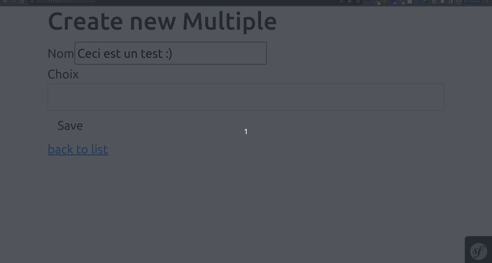

# Symfony UX Autocomplete Demo

This project is a demo of the Symfony UX Autocomplete component.



## Installation

```shell
composer install
npm install --force
npm run build
docker compose up -d
symfony serve -d
symfony console d:m:m
symfony console d:f:l
symfony open:local
```